# Introduction to Computer Networks

## 1. Basic Terminology
* **Computer Network:** An interconnected collection of **autonomous** computers (meaning they operate independently without a permanent master-slave relationship).
* **Interconnection:** The capability of exchanging information over various mediums (copper wire, optical fibre, radio frequencies, etc.).
* **Physical Network:** The actual hardware layout (cables, switches, routers).
* **Logical Network:** The virtual, software-based structure showing how devices communicate.

## 2. Network Protocols
> **Definition:** An agreed format for messages, expressed by a packet header, an optional message component, and a **set of rules** for the exchange of messages between computers.
* Both endpoints *must* understand the protocol for communication to occur.
* Protocols must be formally defined and unambiguous.
* **Examples:** 
  * `HTTP`: Accessing web pages.
  * `IPv6`: Enabling devices to connect to the Internet.
  * `SSH`: Secure remote access.

## 3. Network Models (OSI vs. TCP/IP)
To manage the immense complexity of network communication, functions are separated into different **protocol layers**.
* **Why Layer?** 
  * Provides a well-defined, independent function at a different level of abstraction.
  * Minimizes traffic between layers/interfaces.
  * Makes updating or changing one layer possible without breaking the whole system.

### The OSI Reference Model (7 Layers)
*Mnemonic (Bottom-Up): **P**lease **D**o **N**ot **T**hrow **S**ausage **P**izza **A**way*

1. **Physical Layer (Layer 1):** Transmits raw bit streams (0s and 1s) over the physical communication medium (handles electrical & mechanical interfaces).
2. **Data Link Layer (Layer 2):** Takes raw bits and constructs logical chunks called **frames**. Performs limited error detection/recovery. *MAC addresses operate here.*
3. **Network Layer (Layer 3):** Routes data between systems across networks using **logical addresses** (like IP addresses). *IP protocol operates here.*
4. **Transport Layer (Layer 4):** Provides reliable end-to-end service independent of network topology (Flow control, congestion control, connection management). *TCP operates here.*
5. **Session Layer (Layer 5):** Manages the dialogue/conversation between end systems (synchronisation & negotiation).
6. **Presentation Layer (Layer 6):** Provides standard formats for transferred info (data encoding, display technologies).
7. **Application Layer (Layer 7):** Interface to the user. Allows apps (browsers, email) to access network services. *HTTP operates here.*

```mermaid
flowchart LR

    L1["<div style='text-align:center;'><span style='color:#000; font-size:14px;'>L1 · Please</span><br/><strong style='font-size:18px;'>Physical</strong></div>"]
    
    L2["<div style='text-align:center;'><span style='color:#000; font-size:14px;'>L2 · Do</span><br/><strong style='font-size:18px;'>Data Link</strong></div>"]
    
    L3["<div style='text-align:center;'><span style='color:#000; font-size:14px;'>L3 · Not</span><br/><strong style='font-size:18px;'>Network</strong></div>"]
    
    L4["<div style='text-align:center;'><span style='color:#000; font-size:14px;'>L4 · Throw</span><br/><strong style='font-size:18px;'>Transport</strong></div>"]
    
    L5["<div style='text-align:center;'><span style='color:#000; font-size:14px;'>L5 · Sausage</span><br/><strong style='font-size:18px;'>Session</strong></div>"]
    
    L6["<div style='text-align:center;'><span style='color:#000; font-size:14px;'>L6 · Pizza</span><br/><strong style='font-size:18px;'>Presentation</strong></div>"]
    
    L7["<div style='text-align:center;'><span style='color:#000; font-size:14px;'>L7 · Away</span><br/><strong style='font-size:18px;'>Application</strong></div>"]

    L1 --> L2
    L2 --> L3
    L3 --> L4
    L4 --> L5
    L5 --> L6
    L6 --> L7
```

### The TCP/IP Model (4 Layers)
*Based specifically on the Internet (rather than a generic standard like OSI).*
1. Network Access Layer
2. Internet Layer
3. Transport Layer
4. Application Layer

## 4. Network Topologies
Topology refers to the physical and logical network layout.
* **Bus:** All devices connect to a single shared cable (backbone). 
  * *Pros:* Simple, inexpensive. 
  * *Cons:* Backbone is a single point of failure. Data is visible to all devices.
* **Star:** All devices connect to a central hub/switch via single cables. 
  * *Pros:* Easy to manage, scalable, point-to-point connections. **(Most commonly used today, e.g., home Wi-Fi).**
  * *Cons:* Hub is a single point of failure.
* **Mesh:** Every computer connects to every other computer.
  * *Pros:* High reliability and redundancy.
  * *Cons:* Very complicated wiring, high cost, tricky to troubleshoot.
* **Ring:** Devices connected in a closed loop. Data travels in one direction using a "token" (only one sender at a time).
* **Tree (Star Bus):** A root node branching out to children. Easy to expand.

## 5. Network Standards
* **IEEE (Institute of Electrical and Electronics Engineers):** Focuses on hardware and lower-layer technologies (e.g., 802.3 Ethernet, 802.11 Wi-Fi). Ensures interoperability between manufacturers.
* **IETF (Internet Engineering Task Force):** Focuses on Internet architecture and protocols. Publishes standards as **RFCs** (Request for Comments), e.g., RFC 793 for TCP.

## 6. The Internet & Network Types
* **The Internet:** A "network of networks". Evolved from the ARPANET (1960s). TCP/IP developed by Robert Kahn and Vint Cerf. 
  * *Note:* The Internet is the infrastructure; the WWW (World Wide Web) is just a system that runs *on top of* the Internet.
* **LAN (Local Area Network):** Physically close devices (home, business). High speed, multi-access (e.g., Ethernet).
* **WAN (Wide Area Network):** Connects computers physically far apart (cities, continents). Point-to-point, typically slower than LANs (e.g., Fiber optics, ATM).

---

## Lab 1 Key Takeaways
* **IP Address (Logical Address):** Operates at the **Network Layer (L3)**. Represents a device's location in a network structure rather than the physical hardware. It *can change* when you connect to a different network.
* **MAC Address (Physical Address):** Operates at the **Data Link Layer (L2)**. Uniquely identifies the device's Network Interface Card (NIC). It is permanently assigned by the manufacturer and *never changes*.
