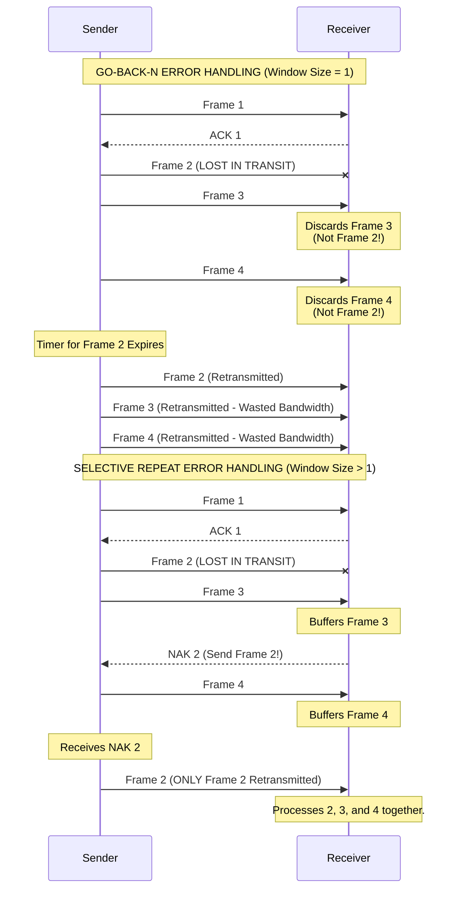

**Format: Mixed Short Answer & Pseudo-code**
*(Note: Questions 2b, 3a, 3b, and 4b are likely from later weeks, but are included for completeness).*

---

## Question 1: CSMA/CD Pseudo-code (10 Marks)
**Task:** Develop an implementation in pseudo-code that simulates the behaviour of the 1-persistent CSMA/CD protocol over 100Mbps Ethernet for $N$ identical nodes. Explain how maximum observed channel utilization is determined.

**Solution:**
```python
# Initialization
N = 10  # number of nodes
nodes = []
for i in range(N):
    # Each node tracks if it has data, 
    # its collision count, and slots to wait
    nodes.append({"has_data": True, "collisions": 0, 
				"backoff_timer": 0})

total_slots = 10000
successful_slots = 0

# Simulation Loop over time
for slot in range(total_slots):
    
    transmitting_nodes = []
    
    # 1-Persistent: If a node has data and its backoff timer is 0, 
    # it transmits immediately
    for i in range(N):
        if nodes[i]["has_data"] and nodes[i]["backoff_timer"] == 0:
            transmitting_nodes.append(i)
            
    # Check what happened on the channel in this slot
    if len(transmitting_nodes) == 1:
        # EXACTLY ONE node transmitted: SUCCESS!
        successful_slots += 1
        winner = transmitting_nodes[0]
        nodes[winner]["has_data"] = False # Done sending
        nodes[winner]["collisions"] = 0   # Reset collisions
        
    elif len(transmitting_nodes) > 1:
        # MORE THAN ONE node transmitted: COLLISION!
        for node_id in transmitting_nodes:
            nodes[node_id]["collisions"] += 1
            c = nodes[node_id]["collisions"]
            
            # Apply Binary Exponential Backoff (freeze at 10)
            if c > 10:
                c = 10 
            
            # Pick a random number of 
            # slots to wait from [0, 2^c - 1]
            max_val = (2**c) - 1
            nodes[node_id]["backoff_timer"] = \
		            random_integer(0, max_val)
            
    # End of slot: decrement backoff timers for waiting nodes
    for i in range(N):
        if nodes[i]["backoff_timer"] > 0:
            nodes[i]["backoff_timer"] -= 1

# --- Calculating Maximum Channel Utilization ---
# Channel utilization (Efficiency) is the fraction of time 
# the channel was doing useful work.
channel_utilization = successful_slots / total_slots
print("Channel Utilization:", channel_utilization)
```

---

## Question 2a: Go-Back-N vs. Selective Repeat (5 Marks)
**Task:** With the use of diagrams, explain the differences between a protocol incorporating go-back-n and a protocol incorporating selective-repeat in the presence of transmission errors.

**Solution:**
The main difference lies in how the receiver handles out-of-order frames when transmission errors occur.
*   **Go-Back-N (GBN):** The receiver has a window size of exactly **1**. It only accepts frames in perfect sequential order. If a frame is lost (e.g., Frame 2), the receiver discards all subsequent frames (3, 4) even if they arrive perfectly. The sender's timer expires, and it must "go back" and retransmit the lost frame and all $N$ frames that followed it.
*   **Selective Repeat (SR):** The receiver has a window size **> 1**. It buffers out-of-order frames. If Frame 2 is lost, the receiver buffers 3 and 4, and sends a Negative Acknowledgment (NAK) specifically for Frame 2. The sender selectively retransmits *only* Frame 2. 



---

## Question 2b: TCP/IP Explosive Growth (5 Marks)
**Task:** Explain how the TCP/IP protocol suite successfully supported the explosive growth of hosts on the Internet.

**Solution:**
1. **Hourglass Architecture:** IP acts as the "narrow waist". Any application (HTTP, FTP) can run over TCP/IP, and TCP/IP can run over any physical medium (Ethernet, Wi-Fi, Satellite). 
2. **Decentralized & Stateless Routers:** Routers don't keep track of individual connections. If a router crashes, packets dynamically route around it. This fault tolerance allowed massive scaling.
3. **End-to-End Principle:** The network itself is "dumb" (just moves packets). The "smart" stuff (error correction, flow control) happens at the endpoints (computers). This made it easy to invent new apps without upgrading the whole internet.
4. **Hierarchical Addressing:** IP addresses are split into Network and Host portions, allowing routing tables to remain small even as millions of hosts joined.

---

## Question 3a: ICMP & Traceroute (5 Marks)
**Task:** Describe how ICMP messages can be used to trace the route IP packets will take from a source address to a destination.

**Solution:**
*   **What is ICMP?** Internet Control Message Protocol. It sits alongside IP at the Network Layer to report errors.
*   **How Traceroute works:** The source sends an IP packet to the destination with a Time-To-Live (TTL) field set to 1.
*   The first router receives it, decrements the TTL to 0, drops the packet, and sends an **ICMP "Time Exceeded"** error back to the source. The source now knows the IP of the 1st router!
*   The source sends another packet with TTL=2 to find the 2nd router, and so on, until the packet hits the destination, which returns an **ICMP "Port Unreachable"** (or Echo Reply).

---

## Question 3b: IP Fragmentation (5 Marks)
**Task:** Describe circumstances where Hop-by-Hop fragmentation vs. Source-Only fragmentation would be preferred.

**Solution:**
*   **Approach 1 (Hop-by-Hop):** Routers fragment large packets if the outgoing link has a small Maximum Transmission Unit (MTU). The fragments are reassembled at intermediate nodes or the final destination. (Used by IPv4). *Preferred when links are highly unreliable, so you only have to resend a small fragment over a bad link rather than the whole massive packet.*
*   **Approach 2 (Source-Only):** The source discovers the smallest MTU along the whole path and fragments the data before sending. Routers never fragment; they just drop the packet if it's too big. (Used by IPv6). *Preferred for high-speed modern routing because it removes heavy processing overhead from the routers.*

---

## Question 4a: Ethernet Packet Structure (5 Marks)
**Task:** Draw a diagram showing the packet structure of a single Ethernet frame carrying an HTTP request delivered using TCP/IP. Highlight connectivity fields.

**Solution:**
The structure relies on encapsulation, looking like nested dolls:
`[ Ethernet Header [ IP Header [ TCP Header [ HTTP Request Data ] ] ] Ethernet Trailer ]`

**Highlighted Fields identifying Source/Destination connectivity:**
1.  **Ethernet Header:** Contains the **MAC Source Address** and **MAC Destination Address** (Identifies connectivity at Layer 2 / physical link).
2.  **IP Header:** Contains the **IP Source Address** and **IP Destination Address** (Identifies logical end-to-end connectivity at Layer 3).
3.  **TCP Header:** Contains the **Source Port** and **Destination Port** (e.g., Port 80 for HTTP. Identifies process-to-process connectivity at Layer 4).

---

## Question 4b: ISO/OSI Security vs TCP/IP (5 Marks)
**Task:** Describe the recommended security mechanisms and how TCP/IP is evolving to address them.

**Solution:**
*   The original TCP/IP protocol suite was built for a trusted academic network and had **zero built-in security**. 
*   Instead of replacing TCP/IP to match the strict OSI security model, the industry "bolted on" security later using separate, evolving protocols:
    *   **IPsec** was added for Network Layer encryption and authentication.
    *   **TLS/SSL** was added above TCP for Transport Layer encryption (creating HTTPS).
    *   **SSH** was created for secure remote Application access.