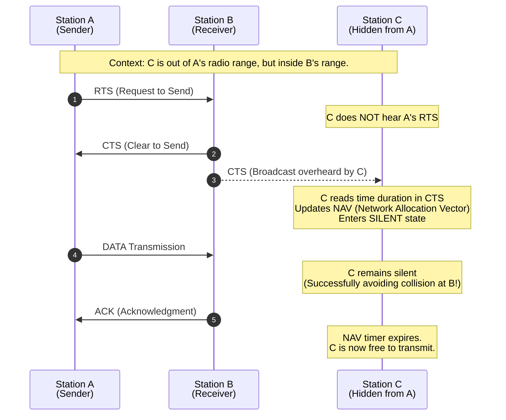

# Wireless Networks & The Network Layer

## 1. Wireless LANs (WLANs) & IEEE 802.11
Wireless networks (like Wi-Fi/802.11) operate differently from wired Ethernet because a station cannot transmit and listen for collisions at the same time (the transmitted signal is a million times stronger than any received signal, effectively deafening the sender).
* **Modes of Operation:**
  * **Infrastructure Mode:** Devices connect to an Access Point (AP) which connects them to the wider network (Internet/Intranet).
  * **Ad-hoc Mode:** Peer-to-peer. Devices associate and send frames directly to each other without an AP.

## 2. The Two Big Wireless Problems
Standard CSMA ("listen before you talk") fails in wireless networks due to limited radio range.
1. **The Hidden Terminal Problem:** 
   * *Scenario:* Node A and Node C both want to talk to Node B. A and C are too far apart to hear each other.
   * *Problem:* A transmits to B. C listens, hears nothing, and also transmits to B. The signals collide at B, destroying the data. A and C are "hidden" from each other.
2. **The Exposed Terminal Problem:**
   * *Scenario:* Node B is transmitting to Node A. Node C wants to transmit to Node D. 
   * *Problem:* C listens, hears B transmitting, and decides to wait. However, C transmitting to D would not have interfered with A's reception. C is "exposed" to B's signal and wastes bandwidth by waiting unnecessarily.

## 3. The Solution: CSMA/CA & RTS/CTS
To solve these problems, 802.11 uses **CSMA/CA** (Carrier Sense Multiple Access with **Collision Avoidance**).
* **RTS/CTS Handshake:**
  1. Sender sends a short **RTS (Request to Send)** frame indicating how long it needs the channel.
  2. Receiver replies with a **CTS (Clear to Send)** frame.
  3. Sender transmits the **Data**.
  4. Receiver transmits an **ACK**.
* **Virtual Sensing (NAV):** Any station that overhears the RTS or CTS reads the duration field and sets its **NAV (Network Allocation Vector)**. The NAV acts as a countdown timer. While the NAV is ticking, the station goes to sleep and will not transmit, successfully avoiding collisions.

## 4. Wireless Reliability & Frame Size
Because wireless links have high bit error rates ($p$) due to background noise:
* Lower data rates use more robust modulation, increasing the chance of success.
* **Shorter frames** are much more likely to survive. 
* *Rule:* If the probability of a single bit error is $p$, the probability of an $n$-bit frame arriving perfectly is **$(1 - p)^n$**. 
* Because of this, large network packets are often **fragmented** into smaller frames before transmission over Wi-Fi.

## 5. Introduction to the Network Layer (Layer 3)
While the Data Link Layer moves frames across a *single* link, the **Network Layer** routes packets from the absolute **source** to the absolute **destination** across multiple different networks (Internetworking).
* **Store-and-Forward Packet Switching:** A router receives a packet, stores it until fully received and verified via checksum, and then forwards it to the next router.
* **Forwarding vs. Routing:**
  * **Forwarding:** The localized action of taking an incoming packet, looking at the routing table, and pushing it out the correct port.
  * **Routing:** The network-wide algorithm that calculates the shortest paths and actually builds/updates the routing tables.

## 6. Shortest Path Routing (Dijkstra's Algorithm)
A *static/nonadaptive* routing algorithm. The network is represented as a graph (Nodes = Routers, Edges = Links). "Shortest" can mean fewest hops, geographic distance, or lowest delay.
* **How it works:** 
  1. The source node is marked as **Permanent** (distance 0). All others are **Tentative** (distance $\infty$).
  2. Examine all directly connected neighbors of the current working node.
  3. Update their tentative distances (Current Node Distance + Edge Cost). 
  4. Pick the node in the entire graph with the smallest tentative distance and make it **Permanent**. It becomes the new working node.
  5. Repeat until the destination is permanent.

## 7. Distance Vector Routing (DVR)
A *dynamic/adaptive* routing algorithm (also known as Distributed Bellman-Ford).
* Routers do *not* know the entire network topology. They only know the cost to their immediate neighbors.
* Routers periodically exchange their routing tables (Distance Vectors) with their neighbors.
* **The Math:** To find the shortest path to Destination Z, a router looks at all its neighbors and calculates: `Cost to Neighbor + Neighbor's Cost to Z`. It picks the path with the **minimum** total cost and updates its table.

---

# Sample Exam Questions & Solutions

### Question 1: Wireless Frame Probability (Math)
In an IEEE 802.11 wireless network, the bit error probability is $p = 10^{-4}$. A station uses the RTS/CTS mechanism to transmit a data frame. The sizes of the frames are:
* RTS = 160 bits
* CTS = 112 bits
* Data = 12,000 bits
* ACK = 112 bits

Calculate the numerical probability that the entire exchange (RTS, CTS, Data, ACK) is completed successfully in one attempt.

**Solution:**
1. The probability of a single bit surviving is $(1 - p) = (1 - 10^{-4})$.
2. For the entire exchange to succeed, *every single bit* of all four frames must survive. 
3. Calculate the total number of bits ($n$): 
   $n = L_{RTS} + L_{CTS} + L_{DATA} + L_{ACK}$
   $n = 160 + 112 + 12000 + 112 = 12,384 \text{ bits}$.
4. Calculate the probability of success:
   $P_{success} = (1 - 10^{-4})^{12384} = (0.9999)^{12384} \approx \mathbf{0.289}$ (or ~28.9%).

### Question 2: Distance Vector Routing (Math)
Assume Router H is directly connected to neighbors I, J, and K. The link costs from H to its neighbors are:
* Cost(H, I) = 2
* Cost(H, J) = 3
* Cost(H, K) = 6

Router H receives the following distance vectors from its neighbors indicating their costs to reach destination **L**:
* I's cost to reach L = 4
* J's cost to reach L = 5
* K's cost to reach L = 2

Using the Distance Vector Routing algorithm, what will be Router H's new Next Hop and Cost to reach destination L?

**Solution:**
Calculate the total cost to reach L through each neighbor:
1. **Via I:** Cost(H, I) + I's cost to L = $2 + 4 = \mathbf{6}$
2. **Via J:** Cost(H, J) + J's cost to L = $3 + 5 = \mathbf{8}$
3. **Via K:** Cost(H, K) + K's cost to L = $6 + 2 = \mathbf{8}$

Router H selects the path with the **minimum** cost. The minimum cost is 6, which goes through neighbor I.
* **Next Hop:** Router I
* **Total Cost:** 6

### Question 3: Hidden vs. Exposed Terminals (Theory)
Explain how the RTS/CTS exchange solves the Hidden Terminal Problem.

**Solution:**
In the Hidden Terminal Problem, a station (C) cannot hear the sender (A) and might transmit, causing a collision at the receiver (B). The RTS/CTS mechanism solves this by having the receiver (B) transmit a CTS (Clear to Send) frame before the actual data transmission begins. Even though C cannot hear A's RTS, it **can** hear B's CTS. When C overhears the CTS, it reads the duration field, updates its Network Allocation Vector (NAV) timer, and remains silent for the duration of A and B's exchange, successfully avoiding a collision.

### Question 4: Dijkstra's Algorithm (Theory)
In Dijkstra’s shortest path algorithm, what is the difference between a "tentative" label and a "permanent" label on a node?

**Solution:**
A **tentative** label represents the currently known shortest distance to a node, but it may be updated (lowered) if a better, faster path is discovered as the algorithm explores the graph. A **permanent** label means the algorithm has definitively confirmed the absolute shortest possible path from the source to that node. Once a label becomes permanent, it is never changed or evaluated again.